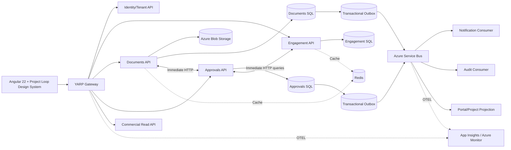

# Project Loop

<div>
  
</div>

Project Loop is a multi-tenant client portal for consulting engagements. It gives external clients and internal consultants a governed place to see project health, milestones, meetings, decisions, deliverables, documents, approvals, invoices, hours consumed, and retainer status.

> Project Loop is not a generic file portal. It is a governed consulting engagement portal where tenant isolation, document lifecycle, approvals, auditing, and reliable cross-domain workflows are first-class architectural concerns.

## Core experiences

### Dashboard

- Project health
- Milestones
- Upcoming meetings
- Outstanding decisions
- Deliverables
- Invoices
- Hours consumed
- Retainer remaining

### Documents

- Architecture diagrams
- Meeting notes
- ADRs
- Requirements
- Statements of Work
- Reports
- Version history
- Publication status
- Client/internal visibility

### Approvals

- Approve architecture
- Approve milestone
- Approve change request
- Accept deliverable
- Capture approver, decision, timestamp, comments, and audit metadata
- Bind an approval to a specific immutable document/deliverable version

## Architectural principles

### Integration rule

Project Loop deliberately uses both synchronous HTTP and asynchronous messaging.

Use HTTP when the caller needs the result before continuing: queries, immediate validation, short commands, direct user interactions, and authorization-sensitive lookups.

Use Azure Service Bus when temporal decoupling adds value: cross-domain state propagation, fan-out, independent retry, notifications, long-running workflows, and events representing completed business facts.

The architecture does not use messaging merely because services are separate.

### Outbox and inbox rule

A service that must atomically persist durable state and publish an integration event SHALL use a transactional outbox. Consumers SHALL be idempotent. A transactional inbox SHOULD be used when message processing changes durable state and duplicate execution could create incorrect side effects.

### Document rule

Azure SQL owns document metadata, lifecycle, visibility, version relationships, and audit facts. Azure Blob Storage owns binary content. A blob URL is never the authorization boundary.

Published or approved versions are immutable. Replacing content creates a new version. An approval always references a specific version.

### Tenant rule

Tenant isolation is a system invariant. TenantId from a request is not authorization. Tenant context is derived from the authenticated user's authorized memberships and enforced server-side.

## Technology baseline

| Area                     | Baseline                                                              |
| ------------------------ | --------------------------------------------------------------------- |
| Backend                  | .NET 10 / ASP.NET Core                                                |
| Identity                 | ASP.NET Core Identity                                                 |
| Local orchestration      | .NET Aspire                                                           |
| Frontend                 | Angular 22 + TypeScript                                               |
| UI styling               | Tailwind CSS + local Project Loop Design System                       |
| API edge                 | YARP                                                                  |
| Sync service integration | Typed `HttpClient`                                                    |
| Async messaging          | Azure Service Bus                                                     |
| Durable messaging        | Transactional Outbox / idempotent consumers / Inbox where warranted   |
| Cache                    | Redis                                                                 |
| Persistence              | Microsoft SQL Server / Azure SQL; database per bounded service        |
| Documents                | Azure Blob Storage + SQL metadata                                     |
| Observability            | OpenTelemetry + Azure Monitor / Application Insights                  |
| Secrets                  | Configuration + Managed Identity / Key Vault in deployed environments |

## Initial bounded contexts

These are proposed starting boundaries and SHALL be confirmed by ADR before implementation freezes them:

- Identity & Tenant
- Engagement / Project
- Document Management
- Approval
- Commercial Read Model
- Notification
- Audit

A dedicated Dashboard service is not required initially. Dashboard data may be composed from domain read APIs until measurable fan-out or latency justifies a projection/read-model service.

## Architecture at a glance



## Canonical showcase workflow

```text
Architect publishes Architecture Vision v3
        -> Documents Service commits version + outbox
        -> DocumentPublished
        -> Approval request created
        -> ApprovalRequested
        -> Notification + Audit + Portal update
        -> Client reviews v3 over HTTP
        -> Client approves v3
        -> Approval decision + outbox commit
        -> ApprovalGranted
        -> Engagement milestone updates asynchronously
        -> PM/client notifications occur independently
```

## Repository guidance

- `CLAUDE.md` is the standing engineering constitution.
- `.claude/rules/` contains path- or concern-specific invariants.
- `.claude/skills/` contains repeatable implementation procedures.
- `.claude/agents/` contains read-only review roles.
- `.claude/hooks/` contains deterministic safeguards.
- `docs/` contains requirements, architecture, design, ADRs, diagrams, and SCRUB microprompts.
