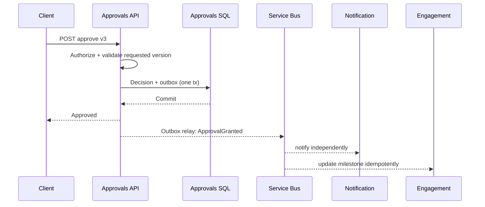

# Approval Workflow

```mermaid
sequenceDiagram
 participant C as Client
 participant A as Approvals API
 participant SQL as Approvals SQL
 participant B as Service Bus
 participant N as Notification
 participant E as Engagement
 C->>A: POST approve v3
 A->>A: Authorize + validate requested version
 A->>SQL: Decision + outbox (one tx)
 SQL-->>A: Commit
 A-->>C: Approved
 A-->>B: Outbox relay: ApprovalGranted
 B-->>N: notify independently
 B-->>E: update milestone idempotently
```
