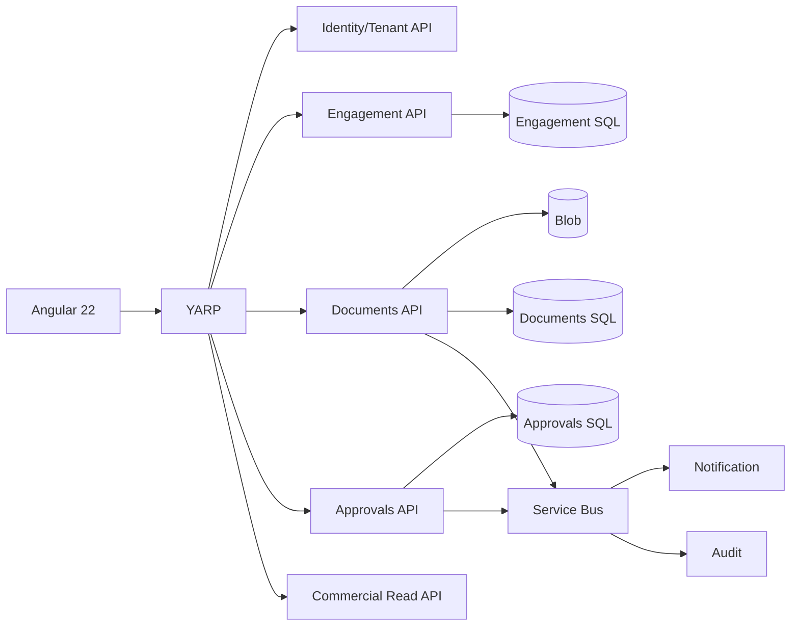

# Container Diagram

```mermaid
flowchart LR
 Browser[Angular 22] --> YARP[YARP]
 YARP --> I[Identity/Tenant API]
 YARP --> E[Engagement API]
 YARP --> D[Documents API]
 YARP --> A[Approvals API]
 YARP --> C[Commercial Read API]
 D --> Blob[(Blob)]
 D --> DSQL[(Documents SQL)]
 A --> ASQL[(Approvals SQL)]
 E --> ESQL[(Engagement SQL)]
 D --> Bus[Service Bus]
 A --> Bus
 Bus --> N[Notification]
 Bus --> Audit[Audit]
```
