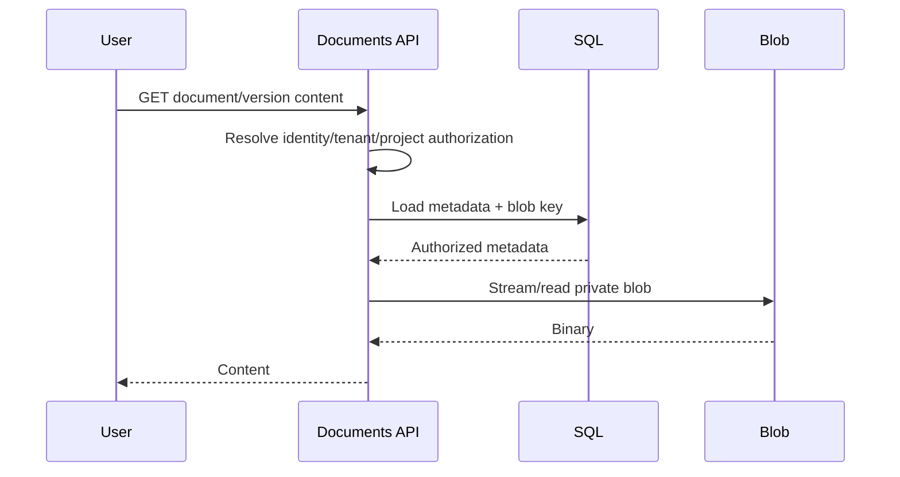

# Document Download Sequence

```mermaid
sequenceDiagram
 participant U as User
 participant D as Documents API
 participant S as SQL
 participant B as Blob
 U->>D: GET document/version content
 D->>D: Resolve identity/tenant/project authorization
 D->>S: Load metadata + blob key
 S-->>D: Authorized metadata
 D->>B: Stream/read private blob
 B-->>D: Binary
 D-->>U: Content
```
