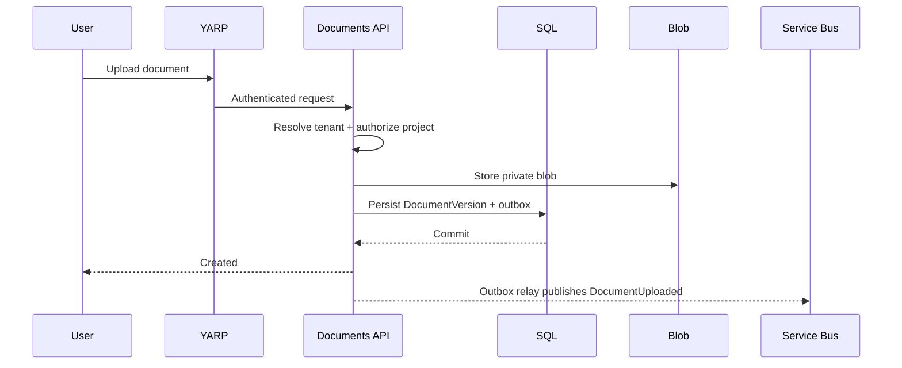

# Document Upload Sequence

```mermaid
sequenceDiagram
 participant U as User
 participant G as YARP
 participant D as Documents API
 participant S as SQL
 participant B as Blob
 participant Q as Service Bus
 U->>G: Upload document
 G->>D: Authenticated request
 D->>D: Resolve tenant + authorize project
 D->>B: Store private blob
 D->>S: Persist DocumentVersion + outbox
 S-->>D: Commit
 D-->>U: Created
 D-->>Q: Outbox relay publishes DocumentUploaded
```
