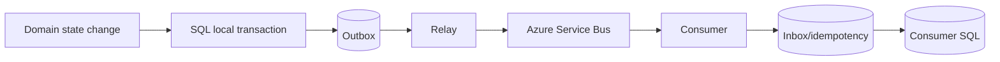

# Event Flow

```mermaid
flowchart LR
 State[Domain state change] --> Tx[SQL local transaction]
 Tx --> Outbox[(Outbox)]
 Outbox --> Relay[Relay]
 Relay --> Bus[Azure Service Bus]
 Bus --> C1[Consumer]
 C1 --> Inbox[(Inbox/idempotency)]
 Inbox --> Durable[(Consumer SQL)]
```
