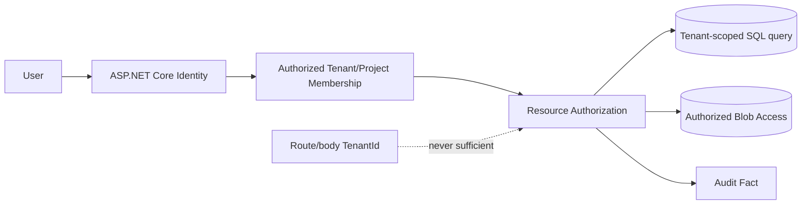

# Tenant Security Boundary

```mermaid
flowchart LR
 User --> Identity[ASP.NET Core Identity]
 Identity --> Membership[Authorized Tenant/Project Membership]
 Membership --> Policy[Resource Authorization]
 Policy --> SQL[(Tenant-scoped SQL query)]
 Policy --> Blob[(Authorized Blob Access)]
 Policy --> Audit[Audit Fact]
 RequestTenant[Route/body TenantId] -. never sufficient .-> Policy
```
